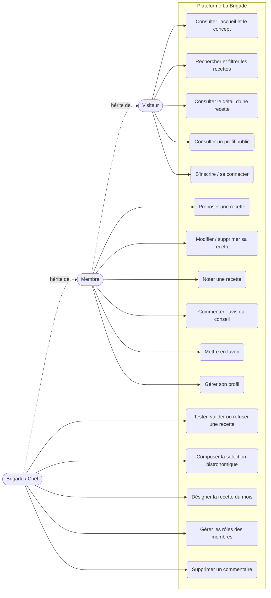
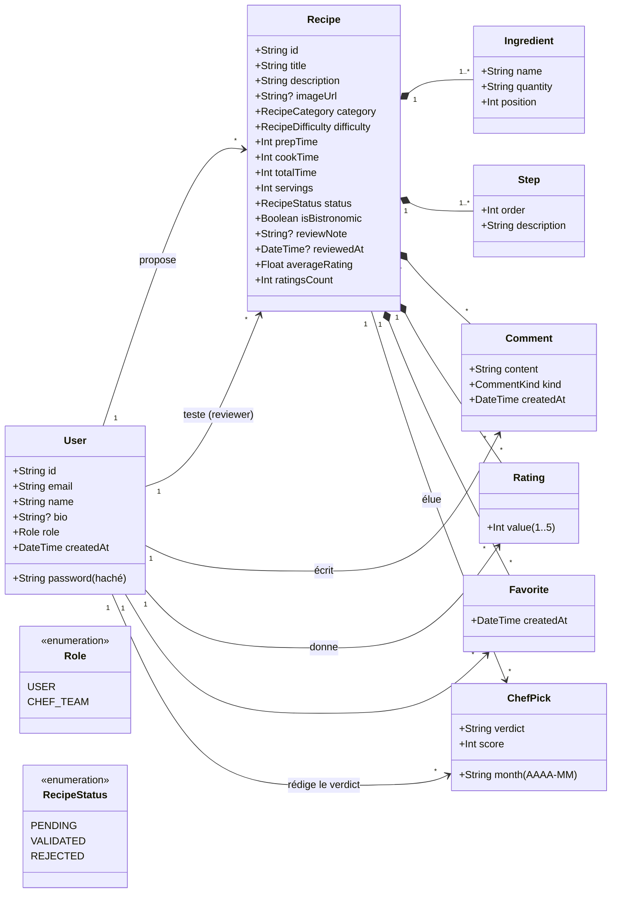
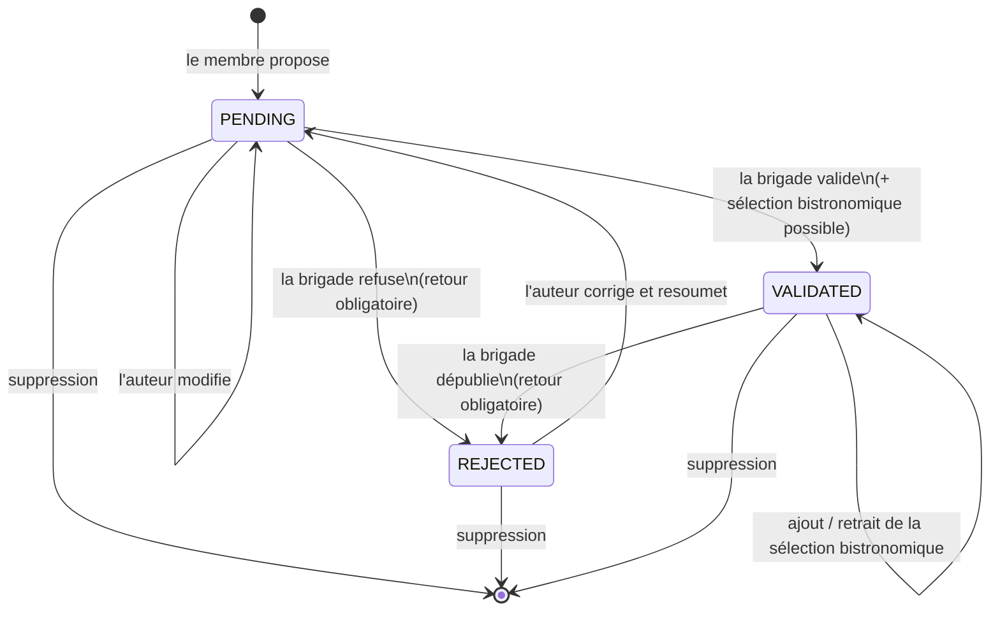
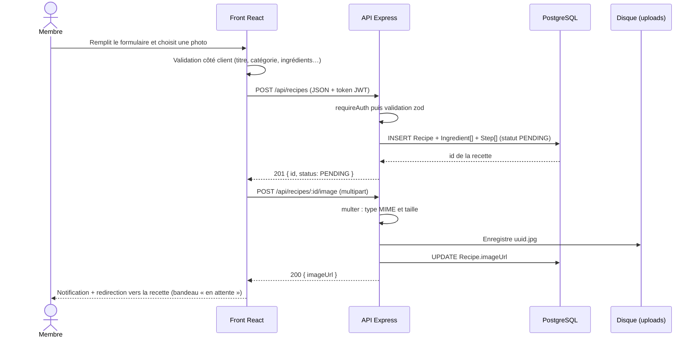
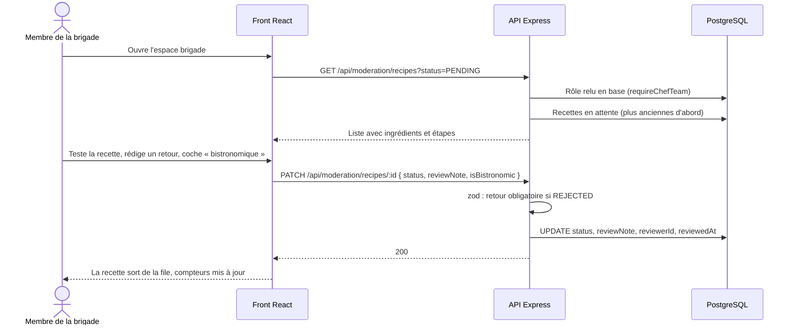
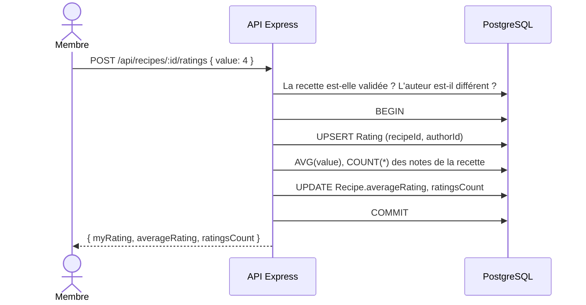
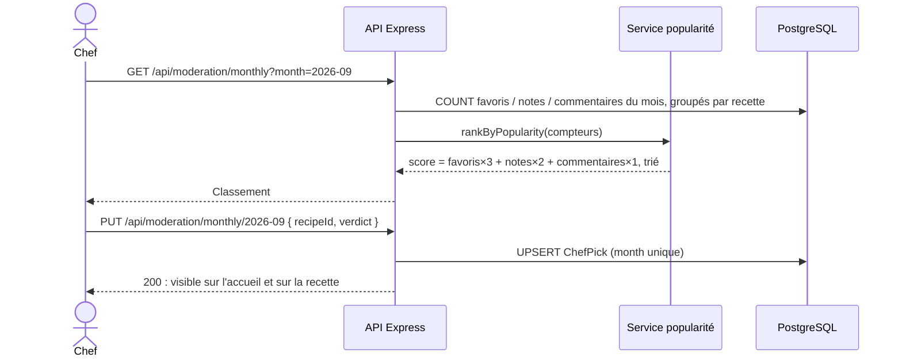

# 2. Conception

## Diagramme de cas d'utilisation

Un membre peut faire tout ce que fait un visiteur ; un membre de la brigade peut faire tout ce que fait un membre.

## Diagramme de classes (modèle métier)

Règles portées par le modèle :

- une note par membre et par recette (`Rating` unique sur `recipeId + authorId`) ;
- un favori par membre et par recette ;
- une seule recette du mois par mois (`ChefPick.month` unique) ;
- la suppression d'une recette supprime ses ingrédients, étapes, notes, commentaires, favoris et élections (composition).

## Cycle de vie d'une recette

| Statut | Visible par | Modifiable par l'auteur | Interactions (notes, commentaires, favoris) |
|---|---|---|---|
| `PENDING` | auteur + brigade | oui | non |
| `REJECTED` | auteur + brigade | oui (renvoie en `PENDING`) | non |
| `VALIDATED` | tout le monde | non | oui |

## Diagrammes de séquence

### Proposer une recette avec une photo

### Validation par la brigade

### Noter une recette (moyenne pré-calculée)

### Recette du mois

