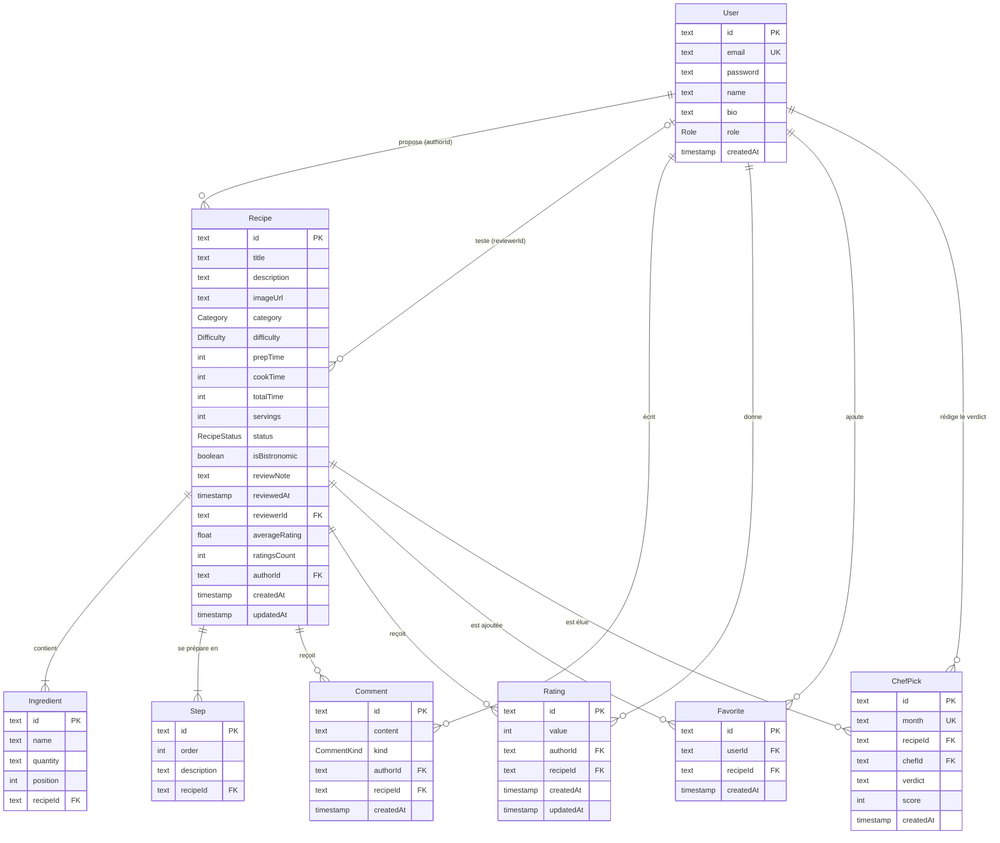

# 3. Base de données

SGBD : **PostgreSQL 16**. Le schéma est décrit dans [`server/prisma/schema.prisma`](../server/prisma/schema.prisma) et versionné par des **migrations** Prisma (`server/prisma/migrations`).

## Modèle entité-association

## Dictionnaire de données

### Énumérations

| Type | Valeurs |
|---|---|
| `Role` | `USER` (membre), `CHEF_TEAM` (brigade) |
| `RecipeStatus` | `PENDING` (en attente), `VALIDATED` (validée), `REJECTED` (refusée) |
| `Category` | `ENTREE`, `PLAT`, `DESSERT` |
| `Difficulty` | `FACILE`, `MOYEN`, `DIFFICILE` |
| `CommentKind` | `AVIS`, `CONSEIL` |

### Recipe

| Champ | Type | Contraintes | Rôle |
|---|---|---|---|
| `title` | texte | 3 à 120 caractères | Nom de la recette |
| `description` | texte | 10 à 2000 caractères | Présentation |
| `imageUrl` | texte | nullable | Chemin `/uploads/<uuid>.jpg` |
| `category`, `difficulty` | enum | défauts `PLAT`, `MOYEN` | Filtres |
| `prepTime`, `cookTime` | entier | 0 à 1440 minutes | Temps |
| `totalTime` | entier | = prep + cook | **Dénormalisé** pour filtrer « 30 min max » en SQL |
| `servings` | entier | 1 à 50 | Portions |
| `status` | enum | défaut `PENDING` | Cycle de vie |
| `isBistronomic` | booléen | faux si non validée | Sélection de la brigade |
| `reviewNote`, `reviewedAt`, `reviewerId` | | nullables | Retour de la brigade et traçabilité |
| `averageRating`, `ratingsCount` | réel, entier | recalculés à chaque note | **Dénormalisés** pour trier par note |

### Autres tables

| Table | Contraintes notables |
|---|---|
| `User` | `email` unique, stocké en minuscules ; `password` haché bcrypt (10 tours) |
| `Ingredient` | `position` conserve l'ordre saisi |
| `Step` | `order` commence à 1 |
| `Rating` | `value` entre 1 et 5 (validé par l'API) ; **unique (`recipeId`, `authorId`)** |
| `Favorite` | **unique (`userId`, `recipeId`)** |
| `ChefPick` | `month` au format `AAAA-MM`, **unique** : une recette du mois par mois |

### Index

| Index | Utilité |
|---|---|
| `Recipe(status, createdAt)` | Liste publique triée par date, file de validation |
| `Recipe(category)` | Filtre par catégorie |
| `Recipe(authorId)` | Profil |
| `Comment(recipeId, createdAt)` | Commentaires d'une recette |

## Choix de modélisation

- **Ingrédients et étapes dans des tables dédiées** plutôt qu'un simple texte : ordre maîtrisé, recherche par ingrédient possible, et structure directement exploitable par une future application mobile (liste de courses, mode pas-à-pas).
- **Identifiants `cuid`** (texte) : non devinables dans les URL et générés sans aller-retour avec la base.
- **Dénormalisation maîtrisée** de `totalTime`, `averageRating` et `ratingsCount`. Prisma ne sait ni trier sur une moyenne agrégée ni comparer la somme de deux colonnes. Ces valeurs sont recalculées dans une **transaction** à chaque écriture concernée, ce qui garantit leur cohérence.
- **Suppressions en cascade** : supprimer une recette ou un compte supprime les données qui en dépendent ; supprimer le membre de la brigade qui a testé une recette met simplement `reviewerId` à `NULL`.
- **Popularité calculée, pas stockée** : le classement du mois est recalculé à partir des dates des favoris, notes (`updatedAt`) et commentaires. Seul le résultat final, la recette élue, est enregistré (`ChefPick`) avec son score au moment du choix.

## Jeu de données de démonstration

`npm run db:seed --prefix server` vide la base et crée 7 membres (dont 2 de la brigade), 14 recettes dans les trois statuts avec photos, des notes, commentaires et favoris répartis sur le mois courant, et la recette du mois précédent.
