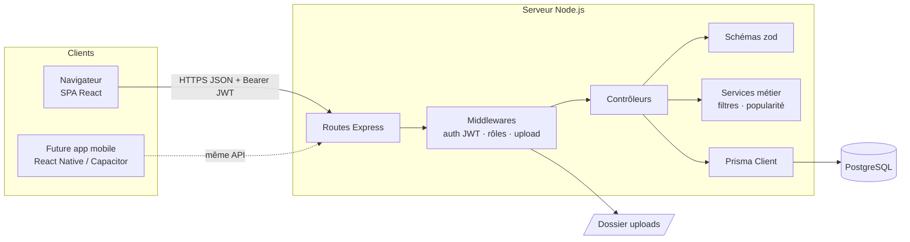
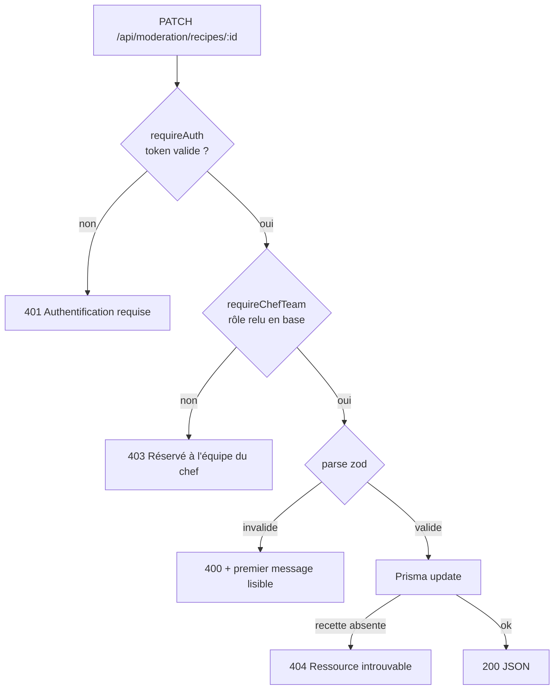

# 4. Architecture technique

## Vue d'ensemble

L'application suit une architecture **client / serveur découplée** : un front React (SPA) consomme une **API REST** en JSON. Cette séparation est le choix structurant du projet : l'API sera réutilisée **telle quelle** par la future application mobile.

En développement, Vite (port 5173) redirige `/api` et `/uploads` vers l'API (port 3001) : le front appelle toujours des chemins relatifs. En production, l'API peut aussi servir le front compilé (`client/dist`) pour un déploiement unique.

## Backend (`server/`)

Organisation en couches, chacune avec une responsabilité unique :

| Couche | Dossier | Responsabilité |
|---|---|---|
| Routes | `src/routes` | Associe une URL et une méthode HTTP à des middlewares et un contrôleur |
| Middlewares | `src/middleware` | `requireAuth`, `optionalAuth`, `requireChefTeam`, gestion centralisée des erreurs |
| Contrôleurs | `src/controllers` | Lit la requête, vérifie les droits métier, orchestre, renvoie la réponse |
| Schémas | `src/schemas` | Validation zod des corps de requête, **messages d'erreur en français** |
| Services | `src/services` | Règles métier **pures**, sans HTTP, testées unitairement (filtres de recherche, score de popularité, gestion des mois) |
| Lib | `src/lib` | Client Prisma, upload multer, sélections Prisma réutilisables, erreurs HTTP |
| Application | `src/app.ts` / `src/index.ts` | `createApp()` construit l'application (utilisée par les tests), `index.ts` la démarre |

### Traitement d'une requête

Les contrôleurs **lèvent** des `HttpError` (`notFound`, `forbidden`…) ; Express 5 transmet automatiquement les erreurs des fonctions asynchrones au middleware `errorHandler`, qui les convertit en réponse JSON `{ error: "message" }`. Les erreurs Prisma connues (enregistrement absent, doublon) et multer (taille de fichier) sont traduites ; les erreurs inattendues renvoient 500 sans divulguer de détail.

## Frontend (`client/`)

| Dossier | Contenu |
|---|---|
| `pages/` | Un composant par route (accueil, liste, détail, proposition/édition, profils, espace brigade, connexion…) |
| `components/` | Composants réutilisables : `Layout` (navbar + pied de page), `RecipeCard`, `ui.tsx` (badges, étoiles, avatars, onglets, pagination, états vides, squelettes), `moderation/` (panneaux de l'espace brigade) |
| `context/` | `AuthContext` : session, rôle, rafraîchissement du token ; `ToastContext` : notifications |
| `lib/` | `api.ts` (client HTTP unique), `types.ts` (types des réponses de l'API), `format.ts` (libellés, durées, dates relatives) |

### Routage et protection

| Route | Page | Accès |
|---|---|---|
| `/` | Accueil | public |
| `/concept` | Le concept | public |
| `/recipes` | Liste + filtres | public |
| `/recipes/:id` | Détail | public (recette non validée : auteur et brigade) |
| `/users/:id` | Profil public | public |
| `/login`, `/register` | Connexion, inscription | public |
| `/recipes/new`, `/recipes/:id/edit` | Proposer / modifier | membre |
| `/profile` | Mon profil | membre |
| `/moderation` | Espace brigade | brigade |

`ProtectedRoute` redirige vers la connexion **en mémorisant la page demandée**, qui est rouverte après connexion. Cette protection n'est qu'un confort d'interface : **tous les droits sont vérifiés par l'API**.

### Gestion de l'état

Pas de bibliothèque d'état globale : l'état serveur est chargé par chaque page, et seul l'état transverse (session, notifications) est dans des contextes React. Les **filtres de la liste des recettes sont stockés dans l'URL**, ce qui permet de partager une recherche, d'utiliser le bouton « retour » et de conserver la page consultée.

## Sécurité

| Risque | Mesure |
|---|---|
| Vol de mot de passe en base | Hachage bcrypt (10 tours), le hash n'est jamais renvoyé par l'API |
| Usurpation | JWT signé (secret en variable d'environnement), expiration 7 jours |
| Élévation de privilèges | Rôle `CHEF_TEAM` **relu en base** à chaque action de modération : un retrait de droits est immédiat, même avec un ancien token |
| Accès aux recettes non publiées | Détail renvoyé en 404 à toute personne autre que l'auteur ou la brigade |
| Données invalides | Validation zod systématique (types, longueurs, bornes) |
| Upload malveillant | Types MIME limités (jpeg, png, webp), 5 Mo, un seul fichier, extension déduite du type et nom aléatoire (UUID) |
| Injection SQL | Requêtes paramétrées par Prisma |
| XSS | React échappe tout le contenu affiché ; aucun HTML utilisateur n'est interprété |
| Fuite d'informations | Emails jamais exposés publiquement ; erreurs 500 génériques |

## Préparation de la version mobile

- **API REST sans état** authentifiée par un en-tête `Authorization: Bearer`, sans cookie : directement utilisable depuis une application native.
- **Types partagés** (`client/src/lib/types.ts`) réutilisables dans une application React Native.
- **Données structurées** (ingrédients et étapes en listes) adaptées aux écrans mobiles.
- **Interface responsive** et **manifeste PWA** : l'application est déjà installable sur l'écran d'accueil d'un téléphone.
- Deux trajectoires possibles, détaillées dans les [choix techniques](05-choix-techniques.md#application-mobile) : Capacitor (réutilisation du front actuel) ou React Native / Expo (réutilisation de la logique et des types).
