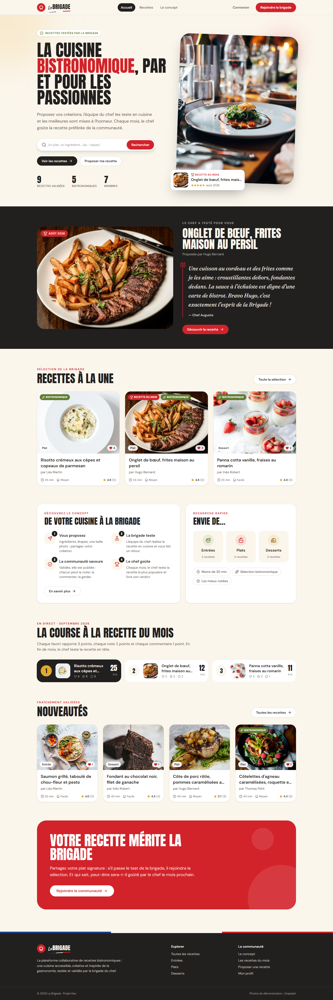
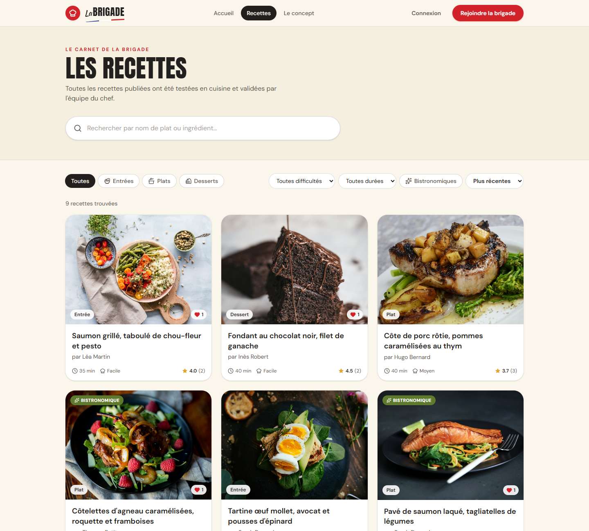
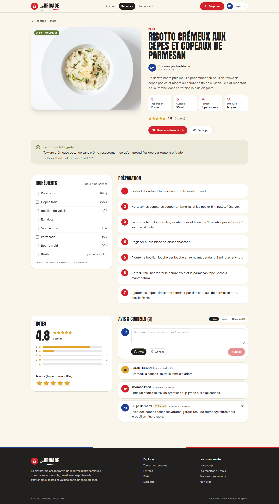
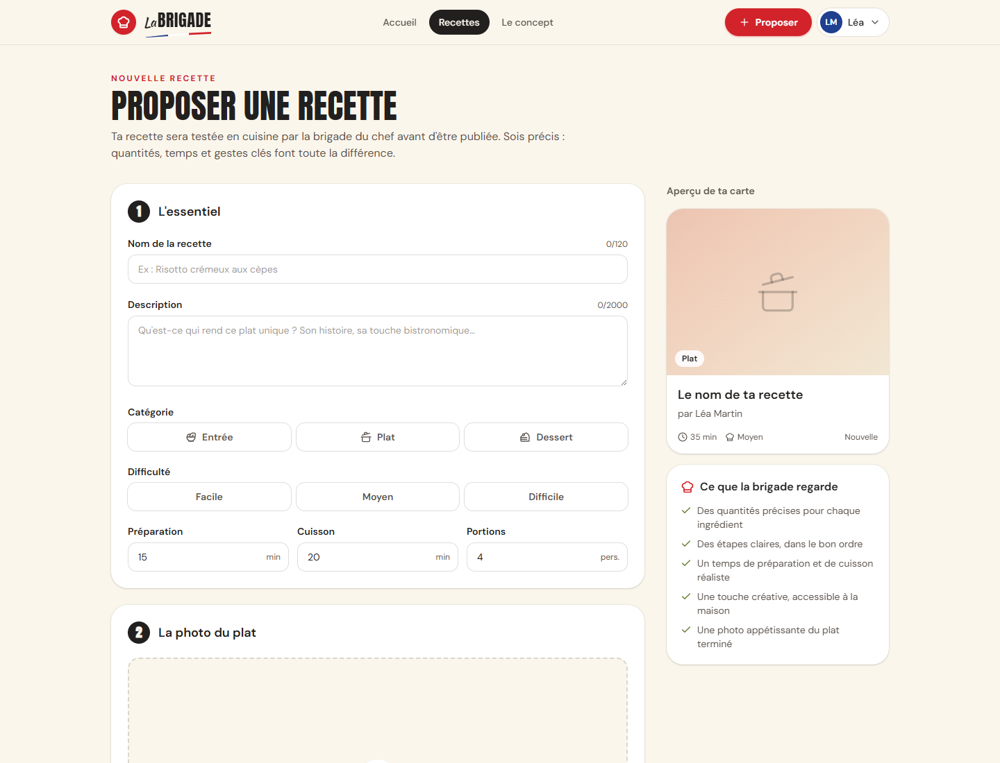
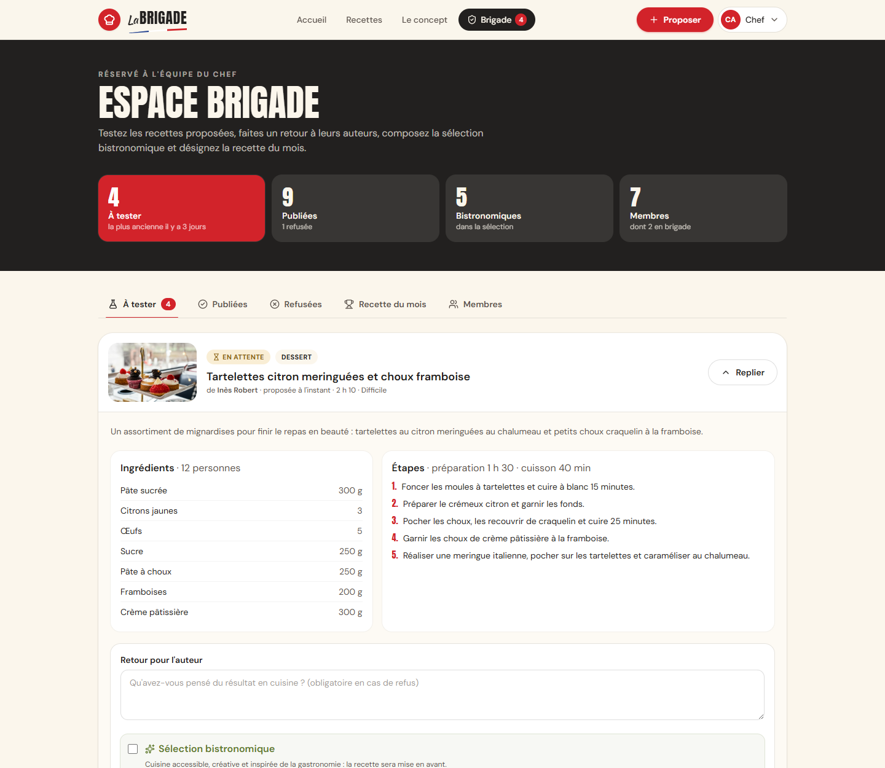
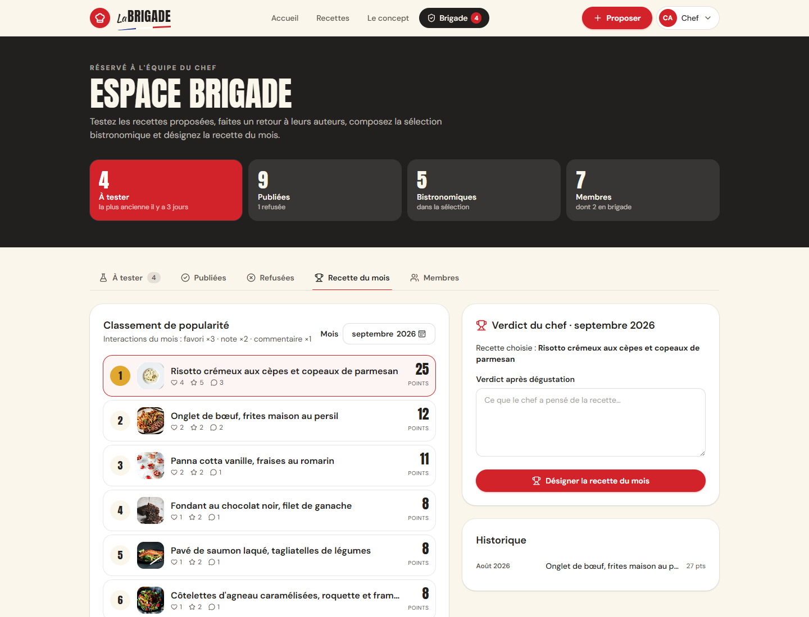
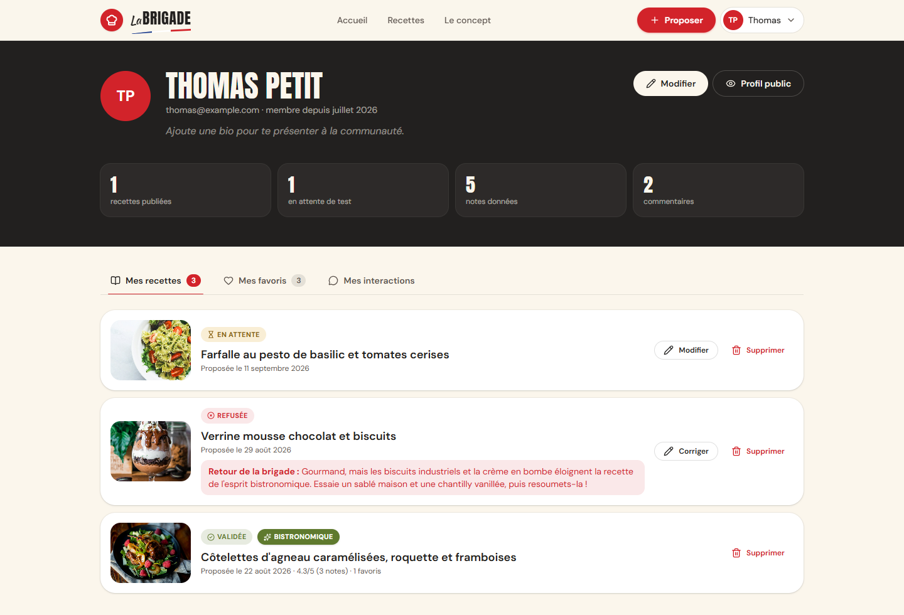
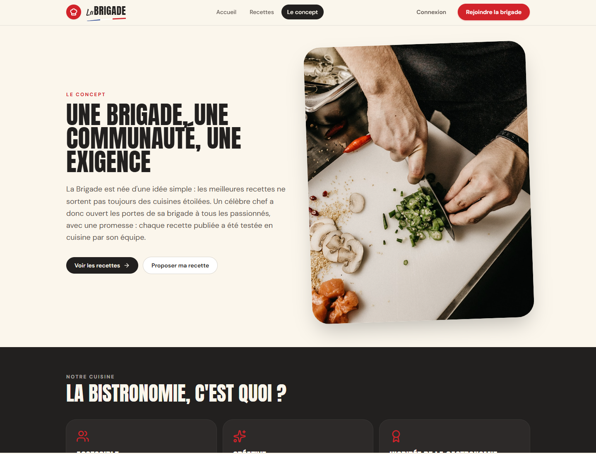
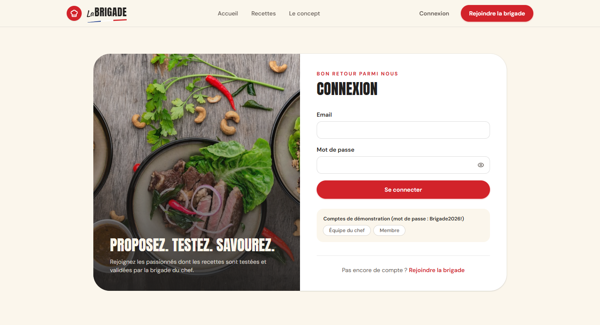
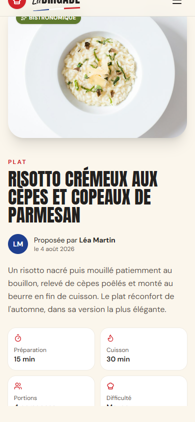

# 7. Maquettes et interface

## Démarche

1. **Veille** : étude de sites de recettes (Marmiton, 750g, Cuisine AZ) et de sites de restaurants bistronomiques. Deux constats en sont ressortis. Les sites de recettes sont très chargés (publicités, pop-ups) ; les sites de restaurants misent sur de grandes photos et une typographie affirmée.
2. **Charte graphique** du client : palette crème / charbon / rouge / olive, logo « La Brigade » avec toque et trait tricolore, typographie moderne, boutons arrondis.
3. **Wireframes** basse fidélité, à partir de la maquette « vue du site par le chef » fournie dans le brief (bandeau d'accueil, recettes à la une, concept et recherche rapide).
4. **Réalisation** directement en composants, puis ajustements à partir de captures d'écran sur ordinateur et sur mobile.

## Principes d'interface

| Principe | Application |
|---|---|
| La photo d'abord | Grandes images, cartes en format 4/3, zoom léger au survol |
| Hiérarchie typographique | Titres en capitales condensées (Anton), texte lisible (DM Sans), verdict du chef en italique à empattements (Fraunces), « La » manuscrit du logo (Kaushan Script) |
| Couleurs porteuses de sens | Rouge = action principale et recette du mois · Olive = validé et bistronomique · Or = notes et attente · Charbon = espace brigade |
| Un statut toujours visible | Badges « En attente », « Validée », « Refusée », « Bistronomique », « Recette du mois » |
| Retour immédiat | Notifications, squelettes de chargement, messages d'erreur précis, boutons désactivés pendant l'envoi |
| Mobile | Menu hamburger, grilles qui passent sur une colonne, cibles tactiles larges |

## Wireframes

### Accueil

```
┌──────────────────────────────────────────────────────────────────┐
│ (toque) La BRIGADE     Accueil  Recettes  Le concept   [Rejoindre]│
├──────────────────────────────────────────────────────────────────┤
│ ✓ RECETTES TESTÉES PAR LA BRIGADE      ┌──────────────────────┐   │
│ LA CUISINE BISTRONOMIQUE,              │                      │   │
│ PAR ET POUR LES PASSIONNÉS             │     GRANDE PHOTO     │   │
│ Texte de présentation…                 │                      │   │
│ [ 🔍 Un plat, un ingrédient…  (Rechercher) ]  ┌───────────────┐│   │
│ [Voir les recettes] [Proposer ma recette]     │🏆 Recette du  ││   │
│ 9 recettes · 5 bistronomiques · 7 membres     │   mois        ││   │
│                                        └──────└───────────────┘┘   │
├────────────── fond charbon ──────────────────────────────────────┤
│ ┌────────────┐  LE CHEF A TESTÉ POUR VOUS                         │
│ │   PHOTO    │  TITRE DE LA RECETTE DU MOIS                       │
│ └────────────┘  « Verdict du chef en italique »  [Découvrir]      │
├──────────────────────────────────────────────────────────────────┤
│ RECETTES À LA UNE                               [Toute la sélection]│
│ ┌────────┐ ┌────────┐ ┌────────┐                                  │
│ │ PHOTO  │ │ PHOTO  │ │ PHOTO  │   carte : badges, catégorie,     │
│ │ Titre  │ │ Titre  │ │ Titre  │   titre, auteur, ⏱ durée,        │
│ │⏱ ⭐4.8 │ │⏱ ⭐4.6 │ │⏱ ⭐4.5 │   difficulté, note               │
│ └────────┘ └────────┘ └────────┘                                  │
├──────────────────────────────────────────────────────────────────┤
│ DÉCOUVREZ LE CONCEPT            │ RECHERCHE RAPIDE                │
│ 1 Vous proposez  2 La brigade   │ [Entrées] [Plats] [Desserts]    │
│ 3 La communauté  4 Le chef      │ (Moins de 30 min) (Bistro) (⭐)  │
│ [En savoir plus]                │                                 │
├──────────────────────────────────────────────────────────────────┤
│ LA COURSE À LA RECETTE DU MOIS  ① ② ③ avec les scores             │
│ NOUVEAUTÉS  ┌──┐┌──┐┌──┐┌──┐                                      │
│ ┌──────────── bandeau rouge : Votre recette mérite la brigade ──┐ │
└──────────────────────────────────────────────────────────────────┘
```

### Liste des recettes

```
┌──────────────────────────────────────────────────────────────────┐
│ LES RECETTES                                                       │
│ [ 🔍 Rechercher par nom de plat ou ingrédient…               ]    │
├──────────────────────────────────────────────────────────────────┤
│ (Toutes)(Entrées)(Plats)(Desserts)  [Difficulté▾][Durée▾](✨)[Tri▾]│
│ 9 recettes trouvées                          Réinitialiser        │
│ ┌────────┐ ┌────────┐ ┌────────┐                                  │
│ │ carte  │ │ carte  │ │ carte  │                                  │
│ └────────┘ └────────┘ └────────┘                                  │
│                    [<] 1 2 3 [>]                                  │
└──────────────────────────────────────────────────────────────────┘
```

### Détail d'une recette

```
┌──────────────────────────────────────────────────────────────────┐
│ ← Recettes / Plats                                                 │
│ ┌──────────────────┐  PLAT                                         │
│ │                  │  TITRE DE LA RECETTE                           │
│ │      PHOTO       │  (LM) Proposée par Léa Martin                  │
│ │                  │  Description…                                  │
│ └──────────────────┘  [Prépa][Cuisson][Portions][Difficulté]        │
│                       ⭐⭐⭐⭐⭐ 4.8 (5 notes)                          │
│                       [♥ Favoris · 4] [Partager] [Modifier]         │
│ ┌ 🏆 Verdict du chef (si recette du mois) ─────────────────────┐   │
│ ┌ ✓ Le mot de la brigade ──────────────────────────────────────┐   │
│ ┌ INGRÉDIENTS ─┐  PRÉPARATION                                      │
│ │ ☐ Riz  320 g │  ① Étape cliquable (marquée comme faite)          │
│ │ ☐ Cèpes 300 g│  ② …                                              │
│ └──────────────┘                                                   │
│ ┌ NOTES ───────┐  AVIS & CONSEILS          (Tous)(Avis)(Conseils)  │
│ │ 4.8 ⭐⭐⭐⭐⭐  │  [ zone de saisie ] (Avis)(Conseil)   [Publier]   │
│ │ ▇▇▇▇▇ 5      │  (SD) Sarah · il y a 2 jours                      │
│ │ Ta note ☆☆☆☆☆│       Commentaire…                                │
│ └──────────────┘                                                   │
└──────────────────────────────────────────────────────────────────┘
```

### Proposer une recette

```
┌──────────────────────────────────────────────────────────────────┐
│ PROPOSER UNE RECETTE                                               │
│ ┌ ① L'essentiel ─────────────────────────┐  Aperçu de ta carte     │
│ │ Nom · Description                       │  ┌────────────┐         │
│ │ [Entrée][Plat][Dessert]                 │  │ carte live │         │
│ │ [Facile][Moyen][Difficile]              │  └────────────┘         │
│ │ Prépa __ min  Cuisson __ min  Portions  │  ┌ Ce que la brigade   │
│ ├ ② Photo : zone de glisser-déposer ──────┤  │ regarde ✓ ✓ ✓      │
│ ├ ③ Ingrédients  [nom][qté] ↑ ↓ 🗑 [+]    ┤  └────────────────     │
│ ├ ④ Étapes       ① [texte] ↑ 🗑   [+]     ┤                         │
│ └─────────────────────────────────────────┘                         │
│ [Envoyer à la brigade]  Annuler                                    │
└──────────────────────────────────────────────────────────────────┘
```

### Espace brigade

```
┌──────────────────────────────────────────────────────────────────┐
│ ESPACE BRIGADE        [4 À tester][9 Publiées][5 Bistro][7 Membres]│
│ (À tester 4)(Publiées)(Refusées)(Recette du mois)(Membres)         │
│ ┌──────────────────────────────────────────────────────────────┐ │
│ │ [photo] EN ATTENTE · DESSERT                 [Tester la recette]│ │
│ │         Titre · de Inès · il y a 3 jours · 2 h 10 · Difficile   │ │
│ │ ├ Ingrédients │ Étapes                                          │ │
│ │ ├ Retour pour l'auteur [.................................]      │ │
│ │ ├ ☐ Sélection bistronomique                                     │ │
│ │ └                                     [Refuser] [Valider]       │ │
│ └──────────────────────────────────────────────────────────────┘ │
│ Onglet Recette du mois : classement ①②③ (points) │ verdict [Désigner]│
└──────────────────────────────────────────────────────────────────┘
```

## Captures de l'application réalisée

Les captures sont générées à partir du jeu de données de démonstration.

| Accueil | Liste des recettes |
|---|---|
|  |  |

| Détail d'une recette | Proposer une recette |
|---|---|
|  |  |

| Espace brigade : validation | Espace brigade : recette du mois |
|---|---|
|  |  |

| Profil | Le concept |
|---|---|
|  |  |

| Connexion | Mobile |
|---|---|
|  |  |
