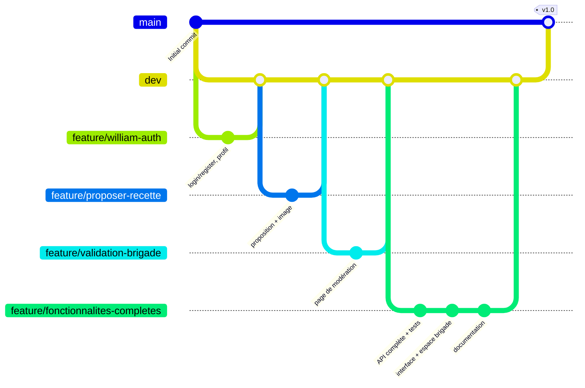

# 8. Organisation du travail et planning

## Répartition des rôles

> Tableau à ajuster avec les membres réels du groupe.

| Rôle | Responsabilités | Membre(s) |
|---|---|---|
| Chef de projet / Scrum master | Planning, suivi du tableau des tâches, animation des points d'équipe, lien avec le client lors des jalons | à définir |
| Référent back-end | Modèle de données, API, sécurité, tests d'intégration | à définir |
| Référent front-end | Composants, pages, intégration de la charte, responsive | à définir |
| Référent UX / design | Veille, wireframes, cohérence visuelle, accessibilité | à définir |
| Référent qualité / documentation | Relecture de code, tests, documentation technique | à définir |

Historique du dépôt : William PLANTEC a posé le socle initial (inscription et connexion, liste, détail, proposition, première page de validation). Fleuris EGBOOU a ensuite repris et restructuré le projet : modèle de données complet, espace brigade, recette du mois, favoris, refonte de l'interface, tests et documentation.

## Méthode

Organisation **agile inspirée de Scrum**, adaptée à un projet court :

- **Sprints d'une semaine**, avec une démonstration à chaque jalon pour recueillir l'avis du client, comme le demande le brief ;
- **tableau Kanban** (GitHub Projects) : À faire → En cours → En revue → Terminé ;
- **point d'équipe court** en début de séance : ce qui est fait, ce qui est prévu, les blocages ;
- **définition de « terminé »** : fonctionnalité testée manuellement, code relu, typage sans erreur, tests au vert, documentation mise à jour.

## Gestion du code (Git)



| Branche | Rôle |
|---|---|
| `main` | Version stable livrée au client |
| `dev` | Branche d'intégration (branche par défaut) |
| `feature/<nom>` | Une branche par fonctionnalité, fusionnée dans `dev` après relecture |

Conventions : messages de commit explicites au présent, une fonctionnalité par branche, pas de secret dans le dépôt (`.env` ignoré, `.env.example` fourni), migrations Prisma versionnées.

## Planning prévisionnel

> Dates prévisionnelles établies à partir du lancement du projet le 11 septembre 2026, à caler sur les jalons officiels de la formation.

```mermaid
gantt
    title Planning prévisionnel — La Brigade
    dateFormat YYYY-MM-DD
    axisFormat %d/%m

    section Cadrage
    Lecture du brief, questions au client     :done, c1, 2026-09-11, 1d
    Veille et analyse du besoin               :done, c2, 2026-09-11, 2d
    Choix techniques et architecture          :done, c3, 2026-09-12, 1d

    section Conception
    Wireframes et charte                      :done, d1, 2026-09-12, 2d
    Modèle de données et diagrammes UML       :done, d2, 2026-09-12, 2d
    Jalon 1 : validation de la conception     :milestone, m1, 2026-09-14, 0d

    section Sprint 1 — Socle
    Initialisation du monorepo                :done, s1, 2026-09-11, 1d
    Authentification                          :done, s2, 2026-09-11, 1d
    Proposition de recette et images          :done, s3, 2026-09-11, 1d
    Liste et détail des recettes              :done, s4, 2026-09-11, 1d

    section Sprint 2 — Fonctionnalités
    Modèle complet, filtres et pagination     :active, f1, 2026-09-13, 3d
    Notes, commentaires, favoris              :f2, 2026-09-14, 3d
    Espace brigade et recette du mois         :f3, 2026-09-15, 4d
    Profils privé et public                   :f4, 2026-09-16, 2d
    Jalon 2 : démonstration au client         :milestone, m2, 2026-09-21, 0d

    section Sprint 3 — Qualité
    Refonte visuelle et responsive            :q1, 2026-09-20, 4d
    Tests unitaires et d'intégration          :q2, 2026-09-20, 4d
    Corrections suite aux retours du client   :q3, 2026-09-22, 4d

    section Livraison
    Documentation et dossier technique        :l1, 2026-09-24, 5d
    Préparation de la soutenance              :l2, 2026-09-28, 3d
    Jalon 3 : rendu final                     :milestone, m3, 2026-10-02, 0d
```

## Backlog (extrait)

| Priorité | User story | Sprint | État |
|---|---|---|---|
| Must | En tant que visiteur, je veux parcourir et filtrer les recettes validées | 1-2 | Terminé |
| Must | En tant que membre, je veux proposer une recette avec photo | 1 | Terminé |
| Must | En tant que brigade, je veux valider ou refuser une recette avec un retour | 2 | Terminé |
| Must | En tant que membre, je veux noter et commenter une recette | 2 | Terminé |
| Should | En tant que chef, je veux voir la recette la plus populaire du mois et publier mon verdict | 2 | Terminé |
| Should | En tant que membre, je veux corriger et resoumettre une recette refusée | 2 | Terminé |
| Should | En tant que membre, je veux garder des recettes en favoris | 2 | Terminé |
| Could | En tant que brigade, je veux donner l'accès brigade à un membre | 2 | Terminé |
| Could | En tant que membre, je veux être notifié quand ma recette est validée | – | Évolution |
| Won't (v1) | En tant que membre, je veux utiliser l'application mobile | – | Évolution |
