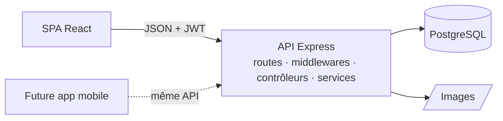
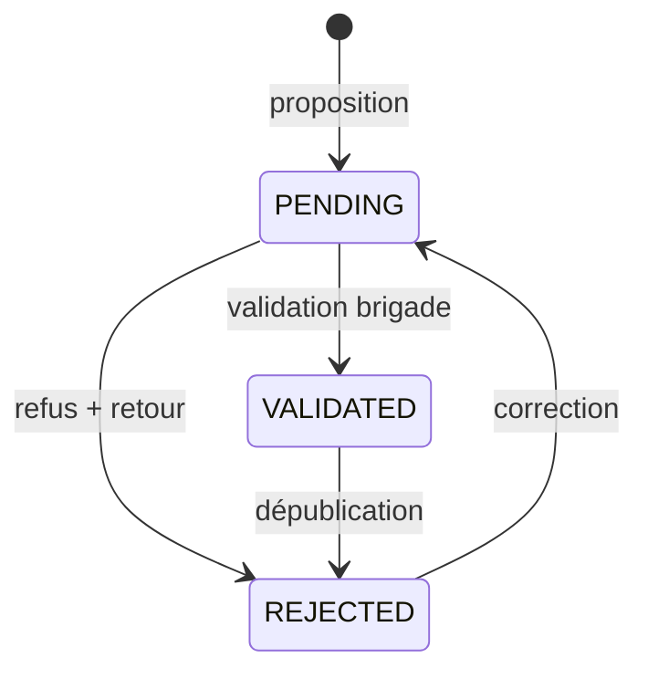

# Dossier technique — Application « La Brigade »

*Projet Dev — IT Project Factory*

---

## 1. Introduction

### Présentation du projet
**La Brigade** est une application web collaborative de recettes, commandée par un célèbre cuisinier français. Les passionnés y proposent leurs recettes **bistronomiques** (une cuisine accessible, créative et inspirée de la gastronomie). Avant d'être mises en avant, ces recettes sont **testées et validées par l'équipe du chef**. La communauté peut ensuite les consulter, les noter, les commenter et les garder en favoris. Chaque mois, le chef teste la recette la plus populaire.

### Objectifs
- Permettre la **publication**, la **consultation** et l'**interaction** autour des recettes.
- Garantir la **qualité du contenu** grâce à un circuit de validation par la brigade.
- Offrir une interface **simple, claire, accessible et belle**, fidèle à la charte graphique.
- Préparer une **future application mobile** disponible sur les stores.

### Résultat en une image

---

## 2. Analyse du besoin

*Détail complet : [01-analyse-du-besoin.md](01-analyse-du-besoin.md)*

### Attentes du client
| Attente | Traduction fonctionnelle |
|---|---|
| Plateforme collaborative | Inscription, proposition de recettes, profils |
| Qualité du contenu | Statuts *en attente / validée / refusée*, seules les recettes validées sont publiques |
| Validation par l'équipe du chef | Rôle brigade, espace de test avec retour à l'auteur |
| Cuisine bistronomique | Sélection « bistronomique » décidée par la brigade, mise en avant et filtre dédié |
| Interaction entre utilisateurs | Notes, commentaires (avis / conseils), favoris, profils publics |
| Recette la plus populaire du mois testée par le chef | Classement automatique et verdict du chef publié |
| Future application mobile | API REST indépendante, JWT, interface responsive, PWA |

### Acteurs
**Visiteur** (consulte), **membre** (propose et interagit), **brigade** (teste, valide, sélectionne, désigne la recette du mois, gère les membres).

### Suggestions apportées
Retour obligatoire en cas de refus et resoumission possible · règle de popularité transparente · distinction avis / conseils · favoris · page « Le concept » · profil public.

---

## 3. Réalisation

### 3.1 Choix techniques
*Justification détaillée : [05-choix-techniques.md](05-choix-techniques.md)*

| Couche | Technologie | Raison principale |
|---|---|---|
| Front | React 19, Vite, TypeScript, Tailwind CSS 4 | Connu de l'équipe, concepts réutilisables en React Native, interface sur mesure |
| API | Node.js, Express 5, zod, multer | Même langage que le front, simple, erreurs asynchrones gérées |
| Données | PostgreSQL, Prisma | Données relationnelles avec contraintes, migrations versionnées, requêtes typées |
| Auth | JWT, bcrypt | Identique pour le web et le mobile, sans état serveur |
| Tests | Vitest, Supertest, Playwright | Tests unitaires, d'intégration et de bout en bout |

### 3.2 Architecture
*Détail : [04-architecture.md](04-architecture.md)*

Le back-end est organisé en couches : routes → middlewares (authentification, rôle) → contrôleurs → schémas de validation et services métier → Prisma. Les règles métier (filtres, popularité) sont des fonctions pures testées unitairement.

### 3.3 Modélisation
*Détail : [02-conception.md](02-conception.md) et [03-base-de-donnees.md](03-base-de-donnees.md)*

Huit tables : `User`, `Recipe`, `Ingredient`, `Step`, `Comment`, `Rating`, `Favorite`, `ChefPick`.

Choix notables : ingrédients et étapes en tables ordonnées, note unique par membre, recette du mois unique par mois, moyenne des notes et durée totale pré-calculées pour trier et filtrer en base.

### 3.4 Sécurité
Mots de passe hachés · droits vérifiés côté serveur (rôle brigade relu en base) · recettes non validées invisibles · validation de toutes les entrées · images contrôlées (type, taille, nom aléatoire) · aucune donnée sensible exposée.

### 3.5 Interface
*Maquettes et captures : [07-maquettes.md](07-maquettes.md)*

Démarche : veille, charte du client, wireframes basés sur la maquette « vue du site par le chef », puis réalisation et ajustements sur ordinateur et mobile. Typographies Anton (titres), DM Sans (texte), Fraunces (verdict du chef) ; couleurs porteuses de sens (rouge = action, olive = validé, or = notes) ; badges de statut ; notifications et états de chargement.

### 3.6 Organisation
*Détail : [08-organisation-planning.md](08-organisation-planning.md)*

Méthode agile (sprints d'une semaine, Kanban, démonstrations aux jalons), Git avec branches `main` / `dev` / `feature/*`, planning prévisionnel sous forme de diagramme de Gantt.

---

## 4. Résultats

### Livrables
| Livrable | Emplacement |
|---|---|
| Application web (front + API) | `client/`, `server/` |
| Base de données versionnée + jeu de démonstration | `server/prisma/` |
| Tests automatisés | `server/tests/` |
| Documentation technique et utilisateur | `docs/` |
| Environnement de développement reproductible | `docker-compose.yml`, scripts `npm` |

### Fonctionnalités réalisées

| Page du brief | Réalisée | Points forts |
|---|---|---|
| Accueil | ✅ | Recette du mois et verdict, sélection à la une, concept, recherche rapide, course du mois en direct |
| Liste des recettes | ✅ | Recherche par ingrédient, 4 filtres, 4 tris, pagination, filtres dans l'URL |
| Détail d'une recette | ✅ | Ingrédients à cocher, étapes à valider, répartition des notes, avis et conseils, favoris, partage |
| Proposer une recette | ✅ | Formulaire guidé, glisser-déposer de la photo, aperçu en direct, modification et resoumission |
| Profil | ✅ | Statut et retour de la brigade pour chaque recette, favoris, interactions, profil public |
| Validation par la brigade | ✅ | File de test, retour obligatoire en cas de refus, sélection bistronomique, recette du mois, gestion des membres |
| Inscription / connexion | ✅ | Retour sur la page demandée, messages d'erreur clairs |

| Détail d'une recette | Espace brigade |
|---|---|
|  |  |

### Qualité
- 31 tests automatisés au vert (unitaires et intégration sur PostgreSQL).
- Parcours complet vérifié dans un navigateur réel.
- Compilation TypeScript sans erreur, interface vérifiée sur mobile.

---

## 5. Conclusion

### Synthèse
L'application répond à l'ensemble du brief : publication, consultation et interaction autour des recettes, avec un circuit de validation qui garantit la qualité promise par le chef. Le projet est parti d'un socle existant. Il l'a fait évoluer par migrations plutôt que par réécriture, a structuré le back-end en couches testables et a produit une interface soignée, fidèle à la charte. L'architecture découplée (API REST + JWT) rend la future application mobile réalisable **sans modifier le serveur**.

### Liens avec la formation
Conception (UML, modèle entité-association) · développement front-end (composants, état, routage, responsive, accessibilité) · développement back-end (API REST, authentification, sécurité) · bases de données relationnelles (modélisation, contraintes, index, migrations) · qualité (tests, typage) · gestion de projet (agile, Git, planning).

### Pistes d'amélioration
*Détail : [10-difficultes-evolutions.md](10-difficultes-evolutions.md)*

Notifications à l'auteur · réinitialisation du mot de passe · stockage des images dans le cloud · recherche plein texte · tags (végétarien, de saison) · mode cuisine pas-à-pas · intégration continue et déploiement · **application mobile** (Capacitor puis React Native).
